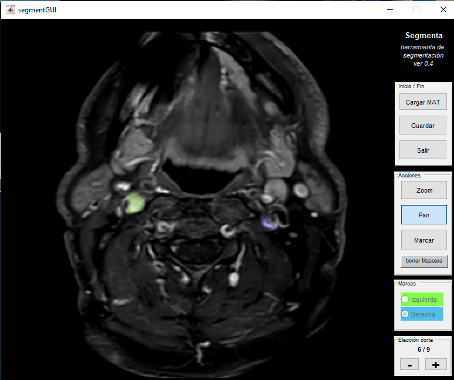

# segmenta
A (very) simple segmentation tool for Matlab

* Can read DICOM files (I've tried only a few - this is not a general reader!.)
* Can save segmentations, by now only two different regions in MAT format for usage within MATLAB.
* Can load those MAT files and modify them as you wish.

To use it, run `segmenta.m` in a Matlab console.

#### Wish-list:
* After segmentation, do some statistics with the selected regions.
* In dynamic sequences, plot the time evolution.
* Export that data to CSV and MAT

> Last update: Sep 11, 2020.

